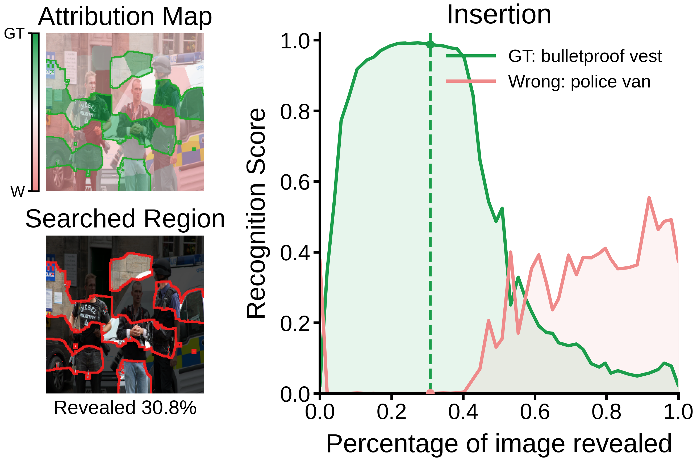

# Visualization Utilities

This directory contains scripts for rendering LiMA attribution results from saved
`json/` and `npy/` outputs.

## Failure Attribution

Use `vis_failure_attribution_diverging.py` to visualize misclassified ImageNet
examples with ground-truth and wrong-class insertion curves. The script skips
samples where `gt_label` and `failure_label` are identical, selects the GT
insertion peak/knee, and renders:

- a diverging attribution map, where green indicates GT-supporting regions and
  red indicates wrong-class-supporting regions;
- the searched region at the selected insertion step;
- GT and wrong-class insertion curves.

<p align="center">
  
</p>

Run a single example:

```bash
conda run -n lima python visualization/vis_failure_attribution_diverging.py \
  --json-file submodular_results/imagenet-clip-vitl-efficientv2-debug/slico-0.0-0.05-10.0-1.0-pending-samples-8/json/465/ILSVRC2012_val_00027663.json \
  --overwrite
```

Run all available examples under an explanation directory:

```bash
conda run -n lima python visualization/vis_failure_attribution_diverging.py \
  --explanation-dir submodular_results/imagenet-clip-vitl-efficientv2-debug/slico-0.0-0.05-10.0-1.0-pending-samples-8 \
  --overwrite
```

By default, figures are written to `failure_visualization_diverging/` under the
selected explanation directory.
